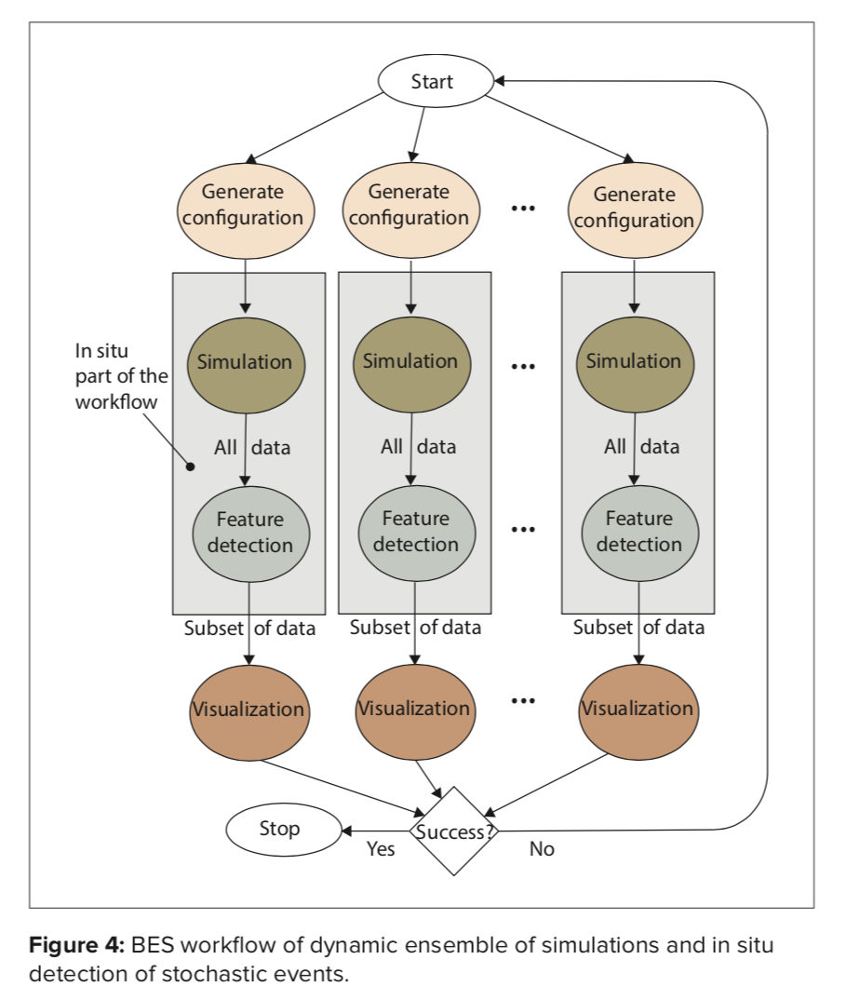
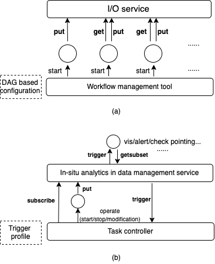

# Contents
1. [Motivation](#introduction)
2. [Approach](#approach)
3. [Implementation](#implementation)

    3.1 [In-memory data storage](#storage)
    
    3.2 [In situ data analytics](#analytics) [roadmap]
    
    3.3 [In-situ Triggers](#trigger) [roadmap]
4. [Installing](#install)
5. [Example](#examples)


## Motivation <a name="motivation"></a>

Gorilla project is an in-memory data management and workflow service for scientific applications such as physical simulation or observing system. This project aims to evaluate the idea of in-situ data management (ISDM) proposed at the [OSTI technical report](https://www.osti.gov/biblio/1493245).

Peterka, Tom, Bard, Deborah, Bennett, Janine, Bethel, E. Wes, Oldfield, Ron, Pouchard, Line, Sweeney, Christine, and Wolf, Matthew. ASCR Workshop on In Situ Data Management: Enabling Scientific Discovery from Diverse Data Sources. United States: N. p., 2019. Web. doi:10.2172/1493245.

In general, the goal of the Gorilla project is to achieve the workflow management shown in the following figure (The figure comes from the osti report) to use in-situ analysis and trigger-based mechanism to relieve I/O bottleneck of the workflow.



Specifically, the Gorilla project contains three parts, the in-memory storage service, in-memory data checking service and trigger-based task controller service. 

## Approach <a name="approach"></a>



The figure shows the comparison of two typical methods to construct the workflow, in case (a), the I/O service only provides the `put` and `get` interface,  the natural way to organize the workflow based on this interface is by DAG-based configuration. The obvious limitation is the multiple data i/o between tasks at different stages.

The case (b) extends the capability of the I/O service, some data checking operation can be executed at the staging service (in-situ analytics), and the corresponding trigger option will be executed when checking operations returns true. The data management service will provide the `subscribe`,  `put` and the `trigger` interfaces 

There are several advantages for the second case:

(1) the in-situ analytics can be executed at the place near the raw data without extra data transfer between nodes

(2) the task can be started only when it is necessary without data polling, which saves the resources.

Generally speaking, the interfaces adopted by the case (b) could better share the knowledge between the different components in the workflow. Specifically, in the scientific workflow, the knowledge mastered by the producer is the model to generate the data, the method of the data partition, and the content of the data. The knowledge mastered by the consumer is the properties of the targeted data and how to process those targeted data (alert, checkpointing, vis, etc.). The classic `put` and `get` interface only let the consumer share the knowledge from the producer. In comparison, the `subscribe` interface could transfer the knowledge mastered by the consumer to the staging service, and staging service owns the knowledge both from the producer (by `put`) and the consumer (by `subscribe`). 

The staging service could use these knowledge to do the computing and checking (these checking services are done at the consumer end previously). Then the staging could use the `notify` interface to trigger the consumer with the knowledge it has (which data partition satisfies the requirements). The `notify` interface can be implemented by different drivers, such as sending the alert, executing the checkpointing or in-situ visualization, etc. This knowledge could also leverage the data producer, such as updating the parameters used by the simulation during workflow running. 

## Implementation <a name="implementation"></a>

We assume that the data consumer only know the information of the application domain and the properties of the targeted data (bounding box, filter functions and the thresholds of the filtered values).

### In-memory data storage <a name="storage"></a>
The implementation of in-memory data storage service layer is inspired by the [DataSpaces](https://github.com/philip-davis/dataspaces) and the [ADIOS](https://github.com/ornladios/ADIOS2) projects.


#### Networking and RPC service

We adopt the [Mochi](https://mochi.readthedocs.io/en/latest/) software stack for networking and the RPC layer. Specifically, the Thallium project is used as the wrapper to implement the RPC service (Margo and Mercury project) and the Argobot is used to manage the threads. The Mercury project could provide multiple data transfer strategies such as TCP, verbs, and shared memory.

#### data put operation

The master-slave pattern is used as the distributed strategy of the staging service. During the stage of the initialization, the slave node will register their address into the master process (process with rank 0). The master service will write the address into the configuration file when the registration step finishes. Every server only need to run on one node, each server process use the Argobot libarary to manamge the threads on this nodes such as processing the rpc requests and start the data checking service. 

In order to utilize the bandwith of the different nodes, when data consumer put the data, we use round roubin patten to get an address (the master server provides the api to return the registered slave service) and the producer will put the data into this nodes. The producer will put the metadata such as the variable name, step, bounding box and the partition identified into the dedicated metadata service (this is dependes on the strategies of the scalability, which will be discussed in details latter).


### In situ data analytics <a name="analytics"></a>

The idea of data-driven and in-situ checking service is inspired by the [Meteor project](https://onlinelibrary.wiley.com/doi/full/10.1002/cpe.1278). The in-situ data checking service in the staging service could check the content of the data in-memory and trigger subsequent operation according the checking results. 

#### profile subscribe

The `subscribe` interface use the profile to tell the staging service how to check the data and what data should be checked. Since the data from the specific vaiable could locate on any server (we use the round robin for data put), we need to subscribe the profile to all the staging server. The user just need to subscribe the profile to the master service and the master service will propagate this profile to the slave services. Since the subscribe is not a high frequent and the data included by profile is just the meta infomation, the overhead of the subscribe is trivial.

#### scalability

one question for the subscription part is that, when the filter is subscribed to the staging service, how the staging know where is the specific data that the subscriber interested. The straightforward solution is subscribe to all the nodes described above. This is not efficient enough if the number of the server is large. For more flexible case, if this profile need to unsubscribe during the workflow running, the master need to send unsubscribe to all the staging service, which is also not efficient. Therefore, the metadata service is necessary, specifically, it the input of the metadata service is the interesting domain of the subscriber and the output is the address of the service where data located. Essentially, the metadata service will maintain the following table (we assume all variable use the same domain, otherwise, we need several those tables):


| index  |  partition identifier |profileName | step 1  | step2 |...| stepn  |
|--------|----------|------------|---------|-------|----|--------|
| 1      |(lowerbound,upperbound)|(list of subscribed profiles)|addr_11| addr_12 |...| addr_1n |
| ...    |...|...|...|...|...|...|
| k      |(lowerbound,upperbound)|(list of subscribed profiles)|addr_k1| addr_k2 |...| addr_kn |

The proportional relation between different entities:

partition identifier:subscribed profile (1:N)
partition identifier:variable Name (1:N) (multiple variables can be located in same partitions)
variable Name : partition identifier (1:N) (ont varaible may across multiple partitions)
variable Name : step (1:N)


There are different patterns to many different implements for implementating the [scalable metadata management service](https://dl.acm.org/citation.cfm?id=3212686) such as table base, hash based, DHT based or bloom filter based methods.

Specifically, we divide the all the services used by staging service into the rawdata service and the metadata service. The above-mentioned table is maintained by the metadata service. After the data put operation, the rawdata service will send the request to the metadata service to update the table. In order to create the table to store the partition information, the user need to call the `init` RPC and send the partition information into the metadata servie. We assume the partition information is static for whole steps firstly. When there is data put operation, the addr of the service where data located for specific step will be registered to the metadata service. The row of the specific partition will also be updated. 

At the beginning state, the metadata table is empty, after the init operation, the metadata table will be 

| index  |  partition identifier |
|--------|----------|
| 1      |(lowerbound,upperbound)|
| ...    |...|
| k      |(lowerbound,upperbound)|

After the subscribed operation, the metadata table will be 


| index  |  partition identifier |profileName |
|--------|----------|---|
| 1      |(lowerbound,upperbound)|(list of subscribed profiles)|
| ...    |...|
| k      |(lowerbound,upperbound)|(list of subscribed profiles)|

If there are data put operation, the corrosponding row will be updated , the raw data service will also ask the metadata service if this partition is subscribed, then the list of the partitiond list will be replied. If the raw node service not create the function defined at the profile, the corresponding functions will be created and the checking operation will be executed. 

By this way, the subscribe operation will not be propagted to all the raw data service list and it will only be replied when the data is first pulled onto the specific nodes and there are subscription at the same time. Essentially, we let the checking operation between region executed at the metadata service to decrease the number of the subscription by this pattern.

The next question is how to maintain the metadata table we listed above in efficient and scalable manner. When the number of the partition increase and there are large number of the request come at the same time to check if the specific partition are subscribed, there will be a bottleneck to use the single service to maintain the metadata table.

The idea of the distributed solution to manage the metadata table is to distribute them among the metadata service evenly. Current solution is to set the number of the metadata service before the system starts. then the master also know the total number of the partitions by `init` function. For example, there are 2n partitions in total and two metadata services. The first service will in charge of the partition from the 0 to n-1 and the second service will in charge of the partition from the n to 2n-1. The region represented by 0 to n-1 can be represented by the bounding box and the region represented by n to 2n-1 can also be represented by the bounding box. Those information can be propagate to all the compute service at the initial step (only need to propagate once at initial step. Or this info can be fetched by the other raw data service at the put operation). Anyhow, the raw data service need to know what is the metadata service it corresponds to when it update the metadata table after the put operation.


#### content of the subscription

The profile need to include the following information:

The identifier of the targeted data such as variable name, step and bounding box. Specifically, The name can be wildcard at the profile, the step can be the value range, the bouding box is the application domain that user interested.

The name of the function to check the data content, the profile just need to contain the name of the function and the parameters it needs. The user could cusztomize the function of data checking. The data checking engine will be described later.

The action need to be triggered, the profile just need to contain the name of the trigger operaion and the parameter it needs, and the user could provide specific trigger endinge. The trigger engine will be described later.

For the future goal, we plan to integrate the data checking with more specific using scenarios. There are some examples of the in-situ analytics to reduce the data or detect interesting data patterns.

(1) filter based on data sampling

https://arxiv.org/pdf/1506.08258.pdf

(2) filter based on precision deduction

https://www.osti.gov/servlets/purl/1338570

(3) filter based on the analytics used in visuzliaztion such as the isosurface (VTK pipeline)

(4) filter based on the machine learning/deep learning model

https://www.nature.com/articles/s41586-019-1116-4

https://dl.acm.org/citation.cfm?id=3291724

When there is data put rpc comes to the staging service, it will check the metdata of the raw data according to the subscribed profiles on this node, such as comparing wether the name, step and bounding box match with the subscribed info. If there is matching, the data will be checked based on the analytics specified at the profile, if the checking operation returns true, the trigger option will be executed. This process is executed asyncrounously after the data put operation. 


### In-situ Triggers <a name="trigger"></a>

The in-situ trigger will be implemented by different underlying engines, and there are several typical cases:

(1) visualize engine

When the data checking operation returns true, the trigger will send the metadata of the targeted data to the visualization engine, then the visualization engine could execute the visualization operation. (such as using the Catalyst of Paraview)

(2) checkpointing engine 

When the data checking operation returns true, the checking point engine could write the data onto the disk for post-processing.

(3) alert engine

The alert operation will be triggered based on the metadata provided by the data checking operation.

(4) task controller

If the checking operation is the function to detect the error of the data when the error is larger than a specific value, it is meaningless to let the simulation run continuously or specific parameters of the simulation need to be adjusted. The trigger service could send the notification to the task controller, and the task controller could stop or modify the corresponding configurations of the simulation.

(5) data aggregation engine

Since the qualified data might be located at the different nodes, if the user wants to aggregate the data, the trigger could send the notification to the data aggregation service. The data aggregation service could get the partitioned data from the staging according to the metadata it receives and aggregates the partitioned data in specific step.

## Installing <a name="install"></a> 

use the ./spack/package.yaml to set up the thallium env, copy this yaml file into the ~/.spack/linux/

for example, if the current dir is the build dir (it is better to put following contents in .gorilla of ~/.gorilla.sh)

```
module load openmpi
module load gcc
source ~/cworkspace/src/spack/share/spack/setup-env.sh
spack load -r thallium
spack load -r abt-io

//make sure the cmake use the suitable gcc version, or let the spack find the correct gcc version
cd /home/zw241/cworkspace/build/build_Gorilla
cmake  ~/cworkspace/src/Gorilla -DCMAKE_CXX_COMPILER=g++ -DCMAKE_C_COMPILER=gcc -DVTK_DIR=~/cworkspace/build/build_vtk

for testing use --cpus-per-task
```

run the unimos server and client on same dir, the address of the master service is stored at the unimos_server.conf

```
# use srun to start the server
srun --mpi=pmi2 --mem-per-cpu=1000 -n 8 ./unimos_server verbs 1
pmix_v2 for mpi 3.x

# use srun to start the client
srun --mpi=pmi2 --mem-per-cpu=1000 -n 16 ./unimos_client verbs
(if the server start by verbs, using verbs://...)
(the master address is written to the shared file system)
pmix_v2 for mpi 3.x
```


## Examples <a name="examples"></a>

**Run UniMOS wih Gray-Scott Simulation**

star the unimos server

```
srun --mpi=pmix_v2 --mem-per-cpu=200000 -n 4 ./unimos_server verbs 1
```

start the simulation and put the data

```
srun --mpi=pmix_v2 -n 4 ./example/gray-scott ~/cworkspace/src/Gorilla/example/simulation/settings.json
```

star the analytics to pull the data

```
# the first parameter is the number of steps and the second parameter is the threshold value for isosurface
srun --mpi=pmix_v2 -n 4 ./example/isosurface 20 0.5
```


### TODO list

add the example of the dynamic trigger interface (stop the simulation running?)

add the controller part (when express every parts of the controller, use two parts, just the name and the parameters list, that all for the user interface)

when delete metadata, delete the raw data
when delete the raw data, delete the metadata

update the delete function of the memcache, if the there is thread pool then wait the finish of all the threads then delete the thread pool
using the queue to check the pushed threads here

update the getaddr interfaces (add the round roubin addr get)

update the put/get interface to the async mode

memory hierachy, set the limitation of the memory, what if the data is full, set the policy, if the old data can be covered

modify the get interface to make the writer and reader run concurrently

add the monitoring interface

when put, there is shape info
add the get by offset (the offset can be multi dimentional) (ok for the function, expose rpc for next step)

implement the connect/gather for one element

store the summary for specific variable such as the latest timestep

update the client code to the async pattern