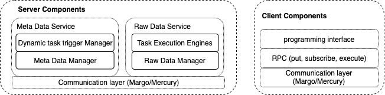

### The architecture of the server and the client

There are three different kind of service 

**The client service**

The programming interface provides the abstraction about how to define the trigger condition, the task execution sequence, and the execution plan.

The API could also be called directly, such as data put from the data producer.

**The raw data object service**

The data will be put into the raw data management service when there is the data put operation. The execution will check the raw data according to the RPC from the scheduler. (The process of the execution is explained at [scratch.md](./scratch.md))

**The metadata service**

The metadata service manages the metadata of the raw data object. The strategy to get the address of the data server is the same with the DataSpaces (using SFC and then get then compute the corresponding id of the metadata service). The scheduler is in charge of starting the execution according to the task execution plan. (The details is explained at [scratch.md](./scratch.md))

   
