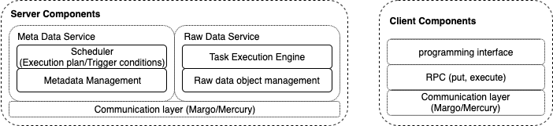

### The architecture of the server and the client



**The client service**

The programming interface provides the abstraction about how to define the dynamic task trigger.

The API could also be called directly, such as data put from the data producer.

**The raw data object service**

The data will be put into the raw data object service when the `put` API is called. The task execution engine will apply the task to the specific data. When to start the task execution is controlled by the scheduler in the metadata service.

**The metadata service**

The metadata service manages the metadata of the raw data object. The strategy to get the address of the data server is the same with the DataSpaces (using SFC and then get then compute the corresponding id of the metadata service). The controller is in charge of starting the dynamic task trigger subscribed by the user. (The details is described at [scratch.md](./scratch.md))


### End to End use case

**the motivation task and current solution**
   
The end to end use case is described based on the following [simulation-analytics-visuzlization](https://github.com/pnorbert/adiosvm/tree/master/Tutorial/gray-scott) workflows:

The simulation (Gray-Scott) is the data producer that runs by the MPI program, and every process will generate a specific data partition. Then the partition will be processed by the `isosurface filter`. The `find_blob` operation will reduce all the partition generated by the `isosurface filter` to calculate the number of the blob in a particular step. If the number of blobs is larger than the specific value, the data will be saved into the VTK file for visualization. 

The current way to execute this workflow is based on the parallel I/O (put/get interfaces such as ADIOS) by following way:

```
mpirun -n 4 build/gray-scott simulation/settings-staging.json &
mpirun -n 4 build/isosurface analysis/isosurface gs.bp iso.bp 0.5 &
mpirun -n 1 build/find_blob analysis/find_blob iso.bp vtkdir &
```

The `gray-scott` simulation outputs raw data into the ADIOS service.  The name of the data identifier is `gs.bp`. The `isosurface` is analytic that runs concurrently with the `gray-scott` simulation and processes the data generated by gray-scott simulation at each step. The input of the `isosurface` is the raw data (`gs.bp`), and the output is the representation of the `isosurface` (the data identifier is `iso.bp`). The `find_blob` operation also runs together with the other two programs and processes the data. It is worth noting that the `find_blob` operation will aggregate all the data partition together because the `find_blob` algorithm needs to run for the whole data partitions generated by a specific step. There is also [parallel version](https://vtk.org/doc/nightly/html/classvtkPConnectivityFilter.html) of the `find_blob`, but it is only available for specific initial settings we only focus on the centralized version here.

**the shortcomings for current solution**

For every data partition, there are at least three times data write and two times data read during the whole workflow described above. The number of the data write/read will also increase when the workflow becomes complicated. Every data write/read operation lead the data movement between different devices. In order to decrease the overhead of the data read/write, one method is to use the high-speed networking and in-memory data staging service as the I/O node to manage the data transfer. However, there is still data movement between in-memory data staging service and data analytics. If we run the data analytics where data is located and transfer the data when it is necessary, those redundant data movements can be avoided. Besides, the computation resources at the in-memory data staging service can also be better utilized. Therefore, the flexible task execution engine needs to be integrated into the data staging service to execute the task in the data staging service. Besides, the flexible controller mechanism also needs to be integrated into the staging service to control the data movement when it is necessary and execute the task on the node where data is located.

**how to use dynamic task trigger in staging service to execute the same workflow**

In the document of [scratch](./scratch.md), we define the dynamic task trigger by the following expression `(Function, Operator, Action)`.  In this part, we will explain how to use multiple dynamic task triggers to execute the workflow described above. We assume the following functions have already been defined at the data execution engine of the data staging services:


`execute_isosurface`: send the RPC to the task execution engine to execute the isosurface filter for the specific data partition.

`check_isosurface_value`: check the object that represents the isosurface. This function returns true if the object contains a valid isosurface value.

`storeObjectandPutMetaData`: store the data object at the current raw data server and update the metadata.

`execute_find_blob`: send the RPC to the task execution engine to execute the find blob filter.

`check_blob_number`: check the return value of the find_blob operation. The function returns true if the number of blobs locates in a specific threshold region.

`outputToVTK`: this function will write the specific data into the VTK file for visualization.

The user can organize the dynamic task execution by the following program:

```
DynamicTrigger trigger_A("<variable name of rawData>", "execute_isosurface", "check_isosurface_value", "storeObjectandPutMetaData")

DynamicTrigger trigger_B("<variable name of isovalue>", "execute_find_blob", "check_blob_number", "outputToVTK")

DynamicTriggerList triggerList = [trigger_A, trigger_B]

registerAndBind ("<bounding box index>", triggerList)
```

For the `registerAndBind ("<bounding box index>", triggerList)`, the dynamic task triggers included in triggerList is registered to the metadata server that associated with the `<index bounding box>`. It also binds the `<bounding box index>` with the `triggerList`. This means when there is udpating of the metadata within `"<bounding box index>"`, the dynamic task triggers defined in triggerList will be checked and started. When there is metadata updating, the corresponding dynamic trigger is executed. For example, the `trigger_A` will be executed when there is an update of the metadata of raw data. The execution of the `trigger_A` follows the description at [scratch](./scratch.md). In particular, it sends the RPC to the task execution engine in raw data service to execute the `isosurface`  filter. The execution results will be returned to the metadata server and checked according to `check_isosurface_value`. If there is valid `isosurface` value, the data generated by the `isosurface` filter will be stored at the corresponding raw data service, and the metadata for isosurface value  will be updated (function `storeObjectandPutMetaData`). The `trigger_B` will be started when there is the metadata update for the isosurface value. The `trigger_B` will execute the `find_blob` operation by RPC call, then the of `execute_find_blob` will be executed when there is return value from the RPC call. If the return value satisfies the requirements, the `outputToVTK` will be executed.

It is worth noting that the first step to execute the `find_blob` operation is to aggreate all the partition from the raw data server. Since the operation of `find_blob` use the `VTK` function. We will provide the data aggregation based on VTK object. The `find_blob` operation will be executed based on this aggregated VTK object. Since there are multiple timesteps, the `find_blob` operation can be executed at different servers for different timesteps

It is even more flexible to declare the dynamic trigger in a recursive way (the dynamic task trigger can be triggered directly by another dynamic task trigger):


```
DynamicTrigger trigger_A("<variable name of rawData>", "execute_isosurface", "check_isosurface_value", "storeObjectandPutMetaData")

DynamicTrigger trigger_C("variable Name", "getMetaData", "checkMetaData", "executeTrigger_A")

register ("<bounding box index>", trigger_A)

registerAndBind ("<bounding box index>", trigger_C)
```

In this example, the metadata will be checked firstly at the metadata server, when it satisfies the requirements such as step is larger than a specific threshold, the `trigger_C ` registered at the staging service will be executed. The `register` API just put the defined trigger into the metadata server. In this case, the start of the dynamic task trigger is the action defined in other dynamic task trigger services. The `registerAndBind` will put the defined trigger into the metadata server and establish the connection between the bounding box and the trigger (the dynamic trigger will be started when the metadata in this bounding box is updated).

It is also worth noting that there is no restriction about the sequence between the data put and the registration of the dynamic task trigger. The dynamic task trigger can be registered before the producer starts or during the producer execution.