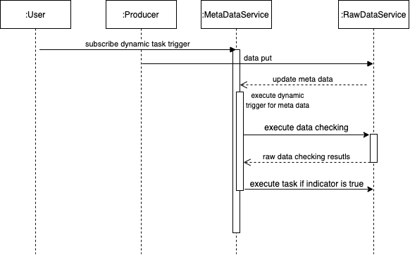

### the motivation and the background

(key challenges, this comes from the ISDM report)
Data management for the workflow faces an increasing diversity and complexity of in situ use cases and platforms. Many of these cases require the ability to make decisions based on prior computation. In the past, control decisions could be made a priori by humans because workflows were simple (e.g., one simulation and one visualization) and had static resource requirements that were known in advance. This is no longer true, as tasks are becoming more difficult
to control manually (e.g., deep learning hyperparameter optimization) and because the overall workflows are becoming larger and more complex, featuring multiple data sources and sinks with dynamically changing requirements. Automated, rather than manual, control of in situ workflows is needed, based on rigorous, explainable, reliable, and trustworthy decision-making.

The essence of decision making in workflow management is to trigger a specific task based on a particular condition. This condition can come from the data during the workflow execution or the runtime information of the workflow management tool. By this way, the workflow can be executed in a data-driven fashion based on the hints provided by user (the user-defined configurations for the task trigger)

**the in-situ detection is tightly coupled with the simulation**

One solution is to integrate the in-situ analytics such as the feature detection algorithm with the simulation. [This work](https://arxiv.org/pdf/1506.08258.pdf) presents the concept of the indicator and trigger. Specifically, the indicator and trigger are lightweight functions evaluated at a high frequency to make dynamic data-driven control-flow decisions. One body of research focuses on "quick sketches" based on the statistical characteristic to trigger some actions. Some works explore how to use the model comes from the offline machine learning to detect the features.Such as [this example](https://ieeexplore.ieee.org/stamp/stamp.jsp?tp=&arnumber=8365977). Since both the simulation and the analytics are data-intensive operations, the limitation for this pattern is that the time used for executing the analytics will influence the execution time of the simulation. There is also a limitation to compile the detection and the in-situ feature detection together if they use different source code and build tools. [Ascent](https://dl.acm.org/citation.cfm?doid=3281464.3281468) also provides the capability of executing the predefined feature detection during workflow execution. When there are interesting things happening, the associated tasks will be triggered.

**the in-situ detection is loosely coupled with the simulation**

Catalyst/SENSI can connect the ParaView server to a running simulation. Data can be extracted from Catalyst instrumented simulation to the ParaView server, and the in-situ analytics can be modified by Paraview during the execution of the simulation. It is also possible to pause the simulation by Paraview in an interactive way. However, the main goal of the middleware, such as SENSI focuses on how to integrate the analytics to assist visualization. Another type of middleware is the data staging service, which moves output data from compute nodes to staging or I/O nodes prior to data storage service (DataStager, DataSpace). By using the high-speed network, this pattern reduces the perturbation when extracting and processing the data. There is a trend to utilize the computing capability at the data staging nodes to improve the flexibility of the workflow. For example, [in this work](https://dl.acm.org/citation.cfm?id=3356158), the error detection operation is integrated with the data staging service. Once a silent error is detected at the staging service before checkpointing, the simulation is rolled back to the last checkpoint and re-executed. However, there is still a lack of a generalized dynamic task trigger mechanism at the data staging service to allow users to express the dynamic task trigger based on customized data checking and feature detection operation.

### the expression of the task triggers

The dynamic task trigger can be composed by following necessary elements:

```
(Checking, Comparing, Action)
```

The `Checking` is the function that is called when the trigger starts, it can be the function to get and check the specific data. The `Comparing` will use the results of the function execution to caculate the indicator value. If indicator is true, the `Action` will be executed.


The control flow for the expression `Trigger(f,o,a)` is

```
results = f()
indicator = Comparing(results)
if(indicator){
    call a()
}
```

For example, one common case is that

```
If the average value for data set d is larger than 10, then trigger task t
```

For this expression, the checking function is `avg of data set d`, and the operator is to execute the `comparison operation (>)` (The number 5 can be the parameter associated with the operator), the action is the task `t`. The function, operator and the action defined here are the interfaces which can be implemented by different concrete class.

### how to integrate the trigger with the staging service

The data is divided into the metadata and the raw data, we could execute the following dynamic trigger at the staging service when there is the update of specific metadata:

```
dynamicTrigger(getMeta(),operator,action)
```

The first parameter is the function `getMeta` in this case, it will extract the metadata of specific variable. For example, the function might extract the timestep from the metadata. The `operator` can be the `greater than`, in this case, the action will be triggered whent the step is larger then specific threshold.

The `action` defined here can be another dynamic trigger:

```
dynamicTrigger(rpcCall,operator,action)
```

The first parameter is the `rpcCall` that sends RPC to the raw data service. This RPC will notify the `task execution enginge` at the raw data service to execute the checking function. The return value might be a list that contains the results of the checking operation from different data partitions. The `operator` can be more complicated in this case since it needs to calculate the indicator value based on several return values from the RPC call. 

### how the put operation work

The first step of the data put operation is same with the DataSpaces. The dynamic trigger will be executed when coresponding metadat is updated. Basically, there are three views for global data domain. The fist is the view from the data staging service, this is decided by the number of the metadata server. If all the servers are the metadata server and the raw data server at the same time, this view depdends on the server number. If there are 4 servers for example, the user need to also provids the layout, such as [2,2,1] which means there are 2 parittion for first dimention, 2 parition for second dimention and 1 partition for the third dimention. Or the user can use the SFC method to partition the data automatically. Another data view is for the simulation, generally speaking, the data writer runs in parallel by large number of process comapred with the staging service. For exmaple, 4 staging services may serve 1024 writers. In this case, the writer will put raw data by round roubin pattern and update there metadata according to the staging server's view. Namely, the metadata is only stored at the staging server that manages a particular domain. And the simualtion partition belongs to this domain. The same ideas are used for data get.

### how to make sure all data parititon are avalible

The original way to make sure all data partitions are ready is to use the lock at the client. In our implementation, we could check id the queried data domain are existing at the server. The algorithm is inspried by this [answer](https://stackoverflow.com/questions/4397226/algorithm-required-to-determine-if-a-rectangle-is-completely-covered-by-another), this is implemented by the `ifCovered` method in the metadataManager. The data pull operation at the client will hang there if the required partitions are not avalibale yet.

### how the task trigger manager work

When the task trigger is subscribed into the staging service (meta data management service), the description of the dynamic trigger will be put to the corresponding task metadata service according to the spatial index. Then when there is a metadata update for a specific metadata server, the data checking operation will be executed, and the execution results are returned to the metadata service after the data checking operation. The metadata server will evaluate the indicator according to the operator defined by the task trigger, and if the indicator value returned by the operator is true, the subsequent task will be executed.

This is the time sequence which shows the interaction between the metadata service and the raw data service:



### the behaviour of the metadata servers

When registering the dynamic trigger into the staging service, the prototype of API is `register(<varName>,<bounding box>,<tuple of the function name that represents the dynamic task trigger>)`. At the register step, the dynamic trigger is indexed by a string (name of the dyanmci trigger) at the metadata server. The server that accepts the dynamic request will calculate the metadata server that corresponds with the region of the bounding box. If there is only one metadata server, the dynamic trigger will be registered into that server. If the region of the bounding box is across the multiple metadata servers, the information of the dynamic trigger is put at the first metadata server, and other metadata servers will store `(<varName> <bounding box> <the address of the fist metadata server> <the name of the dynamic task trigger>)`. In this case, the other metadata server will store a `pointer` to the original metadata server where the real information of the dynamic task triggered located. 

When the data indexed by the second metadata server is updated, the dynamic trigger at the second metadata is executed. Since this is only a dummy dynamic task trigger, it will send a request to the first metadata server to start the real task trigger operation. This strategy will avoid the dynamic trigger to be executed several times if the subscribed domain across the multiple metadata servers. After the metadata put operation, the metadata server just need to check if there is specific `dynamic trigger expression` registered at the current server. The corresponding dynamic trigger will be executed if there are registered dynamic triggers.

### the raw data management and the metadata management

1> how the data is stored and indexed at the raw data service？

The storage layer will use the FIFO cache, there is a queue that maintain the window of the steps. The data out of this window will be dumped into the persistent storage. The data at the raw data server is indexed by the `<step, varName, partition id>`, and both metadata and the raw data are stored there. (refer to ls_add_obj and ss_storage for DataSpaces implementation)

2> how the metadata is indexed at the metadata server ?

The data partition at the metadata server is indexed by the `<step, varName, bounding box>`. the value is the `<address of the raw data server, the partition id>`. (refer to dht_find_entry_all for the DataSpaces implementation, if there are multiple rectangles on one metadata server, some efficient index mechanism such as R tree can be used on specific metadata server)

3> how specific metadata server is found when the raw data service updates the metadata service or when there is API sent by the client according to the bounding box.

The SFC curve is used to transfer the multi-dimensional global domain space into the 1d space, and then the 1d domain is partitioned according to the number of the metadata servers.


### task execution engine

The capability to execute the task at the staging service is provided by the Argobot. It also serves as the thread management tool for the underlying RPC communication layer. The [thallium and mochi framework](https://mochi.readthedocs.io/en/latest/) are used as the communication layer.

### the window maintainer by the staging service

The memory space is limited, it is important to maintain the window of the server (the parameter `m_bufferNum` in the metadataManager) and reuse the memory space. There are two ways to delete the data, one way is to delete the data by the data reader, after finish the data read operaion, it can send the RPC to the data staging service to delete all the data generated by specific time step. Another is to let the staging server delete the old data automatically. For example, the window size is 10, the data generated at the first time step will be deleted when the simulation moves to the 11 step. But there are another issues, if there are some interesting properties of the data and it is not consumed by the reader, the data can not be deleted even if it is out of the buffer. There for, we need to maintain the actual buffered data and the current loer bound and the upper bound. If the buffered data is full, data writer need to wait here. When the `deletableFlag` is false, the corresponding data can not be deleted automatically. (this is part of the future work)

### TODO list

polish docs

polish the mechanism about if the data are deleteable, after the inline checking of metadata udpate, the raw data func should notify the metadata somewhere

ask the server if the buffer is full before putting the data

collect sim information dynamically and adjust thread pool's size automatically