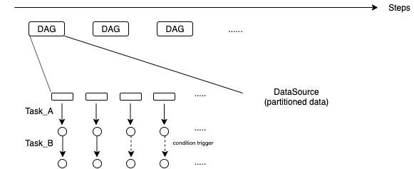

### this doc list some the key questions of the system design

**the motivation and the background**

For in-transit processing, the data is acquired by the `data get` operation after the `data put`. This pattern is not flexible for the situation that only some parts of the data need to be processed. For example, when there are multiple partitions of the data is put into the staging service, but only some parts of the data need to be processed, it is necessary to filter out the partition that satisfies the user requirements. To fully utilize the idle resources of the staging service and process the specific data partition only when it is necessary, it is necessary to integrate the mechanism of the dynamic task trigger service into the staging node. The task trigger condition can be the operation such as feature detection, data error detection,  or just the data transfer operation such as dumping the data into the disk or transfer the data to the visualization.

**the state-of-art solution for the in-situ workflow**

Stream processing based on the parallel I/O tool:
Task A sends the data to parallel I/O (such as ADIOS) and underlying device, the task B load the data from the parallel I/O and process the data. Multiple tasks can be made based on the parallel I/O service. 

In-situ (In-line in-situ, tightly coupdled): 
The analytics and the visualize is composed together with the simulation. The advantage is to save the time caused by the data transfer between tasks. The defect is the complexity of the workflow design since different services need to be compiled together. Another defect is the pause of simulation during the execution.

In-situ (visualization adaptor):
The visualization tool such as the Catalyst is instrumented into the simulation. The raw data is transferred to the visualization tool, such as the Paraview for in-situ processing. The user could get the simulation results in real-time.

In-transit (loosely coupled):
The data is sent to the staging service by data put API, then data is acquired by `data get` from the analytics/visualization. The staging service can be used to process the data such as error detection before the data get operation. 

There still lacks a general programmable mechanism in staging service to control the data trigger based by data-driven pattern. The task in staging service needs to launch dynamically when user-defined requirements are satisfied. This mechanism is required by in-situ workflows for different scenarios. For example, the feature detection can be integrated into the staging service. The subsequent task is triggered for specific data partition when data satisfy a specific pattern. The error detection operation can be integrated into the staging service, the data partition with the error value will not be processed by subsequent task, and the alert message will be sent out.

Although there are several tool provides the in-memory execution based on parallel IO (HDF5, ADIOS).

SENSI https://gitlab.kitware.com/sensei/sensei/tree/master
Ascent  https://ascent.readthedocs.io/en/latest/Overview.html https://github.com/Alpine-DAV/ascent
CINEMA https://cinemascience.github.io/examples.html https://cinemasciencewebsite.readthedocs.io/en/latest/

All these tools are tightly coupled with the visualization tools and aim to filter/trigger the data for visualization. There still lacks a more general dynamic trigger tool at the data staging layer.

**the expression of the dynamic task trigger**

If we use the DAG to represent the task execution. In the DAG, the node of every graph represents a dataset and the edge between two nodes represents the dynamic trigger. The edge between two nodes contains three necessary elements: (DataChecking, Indicator, Condition, Action).

For example, for the `Data_A -> Data_B` where the `->` represents the dynamic task trigger.

The `DataChecking` is a function that maps the `Data_A` into `Indicator`. The `Indicator` is a flag which can be a single value or specific data structure. The `Condition` is the operation that maps the `Indicator` into a boolean value. If the boolean value is true, the `Action` is executed and if the boolean value is false, the `Action` will not be executed. The `Action` is a function that transfer the `Data_A` into the `Data_B`.

For the static trigger, the `DataChecking` and the `Indicator` are empty, the `Condition` is always true. The `DataChecking` operation can be splitted into two specific types, the `metadata_Checking` is executed at the metadata server and the `rawdata_Checking` is executed at the raw data service.

```
// this is the pseudocode code
// define the necessary elements
define DataChecking
define Indicator
define Condition 
define Action

//define the dynamic trigger
dynamicTrigger dtsource(DataChecking,Indicator,Condition,Action)
dynamicTrigger dttask(DataChecking,Indicator,Condition,Action)

DAG dag
dag.dtsource().dttask()

startExecution(dag,boundingbox)
```

**how the put operation work**

The first step of the data put operation is same with the DataSpaces. 

**how the task scheduler work for dynamic task trigger**

When the `startExecution` is called, the `DAG` will be put to the corresponding task scheduler. If the domain across multiple metadata server, all the metadata server will get coresponding DAG. Then when there is metadata update for specific metadata server, the data checking operation will be executed, then the indicator is executed according to the condition. If it is ok to check the metadata, the RPC will be sent to the raw data service to check the raw data.

(TBD)
If there is one data partition across the whole domain but multiple metadata service, all the metadata server contain the metadata of this partition. When there is subscribe, the DAG locates on every data server. When there is data update, the same metadata locates on different metadata service. If using the same scheduler strategies, the raw data will be checked multiple times. (potential solution, before sending the DAG to the raw data service, ask if this DAG is in execution) (control the number of the master server, make it larger than the partition number)

**how to run the task and where to run the task**

the task (Action) will run when the indicator satisfy the condition. The action can run at the metadata server (there might be several partitions returns several indicator values)

**how to build complex cases based on the condition trigger primitives**

(TBD, one potential solution is to use different status to label the raw data)

