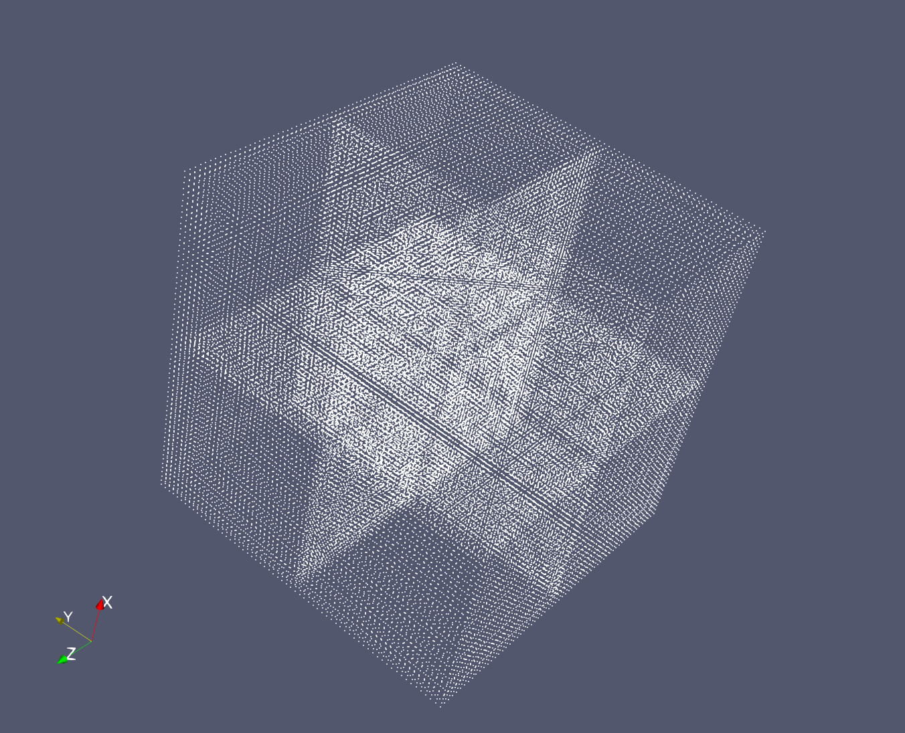
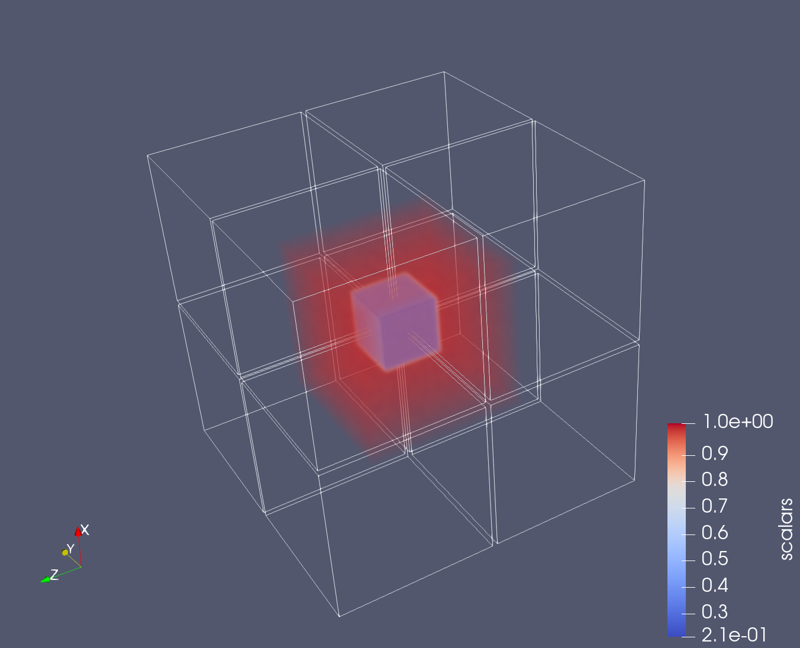

This is the example to show the N:M data put and get

### configuration of the Gorilla

start the server by following configurations 

```
{

    "dims": 3,
    "metaserverNum": 4,
    "maxDimValue": 63,
    "protocol": "verbs",
    "masterInfo":"./unimos_server.conf",
    "datachecking": false,
    "logLevel":1
}

```

set the ` "L": 64` in the `./example/setting.json`.

then to use the commands to start the server (on Amarel)

```
srun --mpi=pmix_v2 --mem-per-cpu=10000 --time=00:15:00 -n 4 --ntasks-per-node=1 --cpus-per-task=1 --constraint=hal,broadwell,edr ./unimos_server ~/cworkspace/src/Gorilla/server/settings.json
```

### run simulation to put data into the staging service

```
mkdir vtkdataraw

// this direactory store the vti data for checking
// the simulation will put the data into the staging service 
// and then write the same data into disk

srun --mpi=pmix_v2 -n 8 ./example/gray-scott ~/cworkspace/src/Gorilla/example/simulation/settings.json
```

### run analytics to get and process the data

only start one analytics to test the N:M put and get

```
mkdir vtkdata

// this dir will store the vti data outputted by the analytics
srun --mpi=pmix_v2 -n 1 ./example/isosurface ~/cworkspace/src/Gorilla/example/simulation/settings.json 5 0.5

//for performance testing, adjust the index at the isosurface, comment out the write vtk operation
srun --mpi=pmix_v2 --mem-per-cpu=50000 --ntasks=2 ./example/isosurface ~/cworkspace/src/Gorilla/example/simulation/settings.json 5 0.5
```

### results



For the figure shown above, there is the 8 partition of the outputted data. The global domain is from the `[0,0,0]` to `[63,63,63]`.



For the figure shown above, the colored region is the data partition queried by the analytics, the bounding box of the queried data is from `[15,15,15]` to `[47,47,47]`。